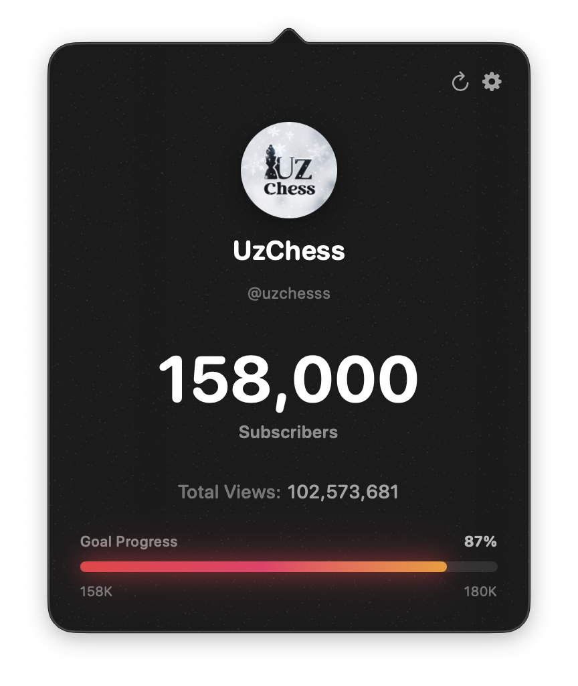
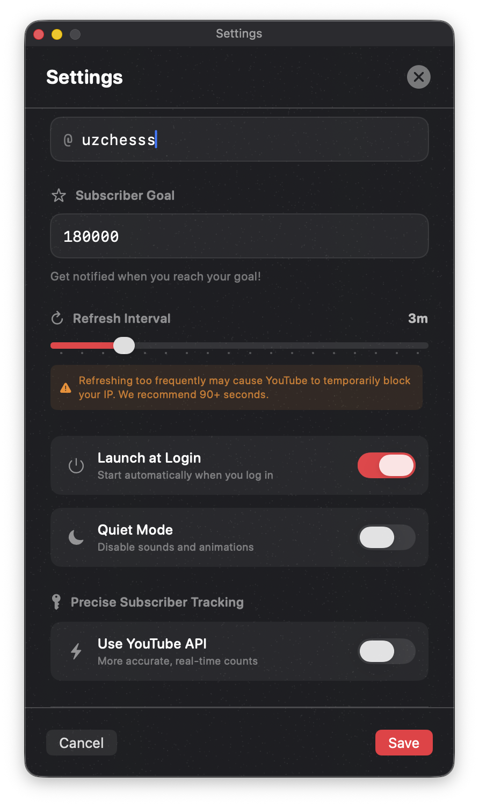
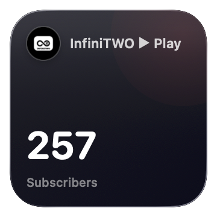

# 📈 YouTube Data – macOS Menu Bar Tracker

> **Note:** This app is currently in the **Pre-Release** phase and is not yet available on the Mac App Store. It is being fine-tuned for the ultimate native macOS experience.

Built for the pure joy of watching your community grow. **YouTube Data** is an ultra-lightweight, beautifully designed macOS Menu Bar application and Widget set that lets you keep an eye on your YouTube subscribers and views with zero friction. No heavy dashboards, no browser tabs—just a quick glance at your menu bar to warm your heart. ❤️

  <table>
    <tr>
      <td align="center" valign="top">
         
         <b>Menu Bar UI</b>
      </td>
      <td align="center" valign="top">
         
         <b>App Settings</b>
      </td>
    </tr>
    <tr>
      <td align="center" valign="top">
         
         <b>Small Widget</b>
      </td>
      <td align="center" valign="top">
         
         <b>Medium Widget</b>
      </td>
    </tr>
  </table>

## ✨ Features

- **Menu Bar Integration:** See your live subscriber count (`158K`) and channel avatar directly in the macOS menu bar.
- **Beautiful Widgets:** Small and Medium desktop widgets designed perfectly for macOS Sonoma.
- **Goal Tracking:** Set a subscriber milestone and watch the sleek gradient progress bar fill up.
- **Smart Data Fetching:** Choose between free, limitless HTML scraping or precise real-time tracking via the official YouTube API.
- **Deep Customization:** Launch at login, customizable refresh intervals (with API rate-limit warnings), and a "Quiet Mode" for focus.
- **Dark Mode First:** Gorgeous, native SwiftUI aesthetics that blend seamlessly into your Mac.

---

## 🛠 Under the Hood: The "Wow" Performance Factor

What makes this app special isn't just what it does, but *how* it does it. Most electron-based or poorly optimized menu bar apps quietly drain your MacBook's battery and eat up RAM. 

This app was subjected to extreme profiling via **Xcode Instruments** and heavily optimized for **Zero Energy Impact**:

* 🛑 **0.7GB to ZERO Disk I/O:** Switched `URLSessionConfiguration` from `.default` to `.ephemeral`. The app no longer excessively caches megabytes of HTML data to the SSD, completely eliminating disk writes/reads during polling.
* 🧠 **97% RAM Reduction:** Avatars fetched from YouTube (often 800x800px) are decoded and aggressively resized in-memory to 128x128px *before* being stored in the App Group. Dropped memory footprint from **~60MB down to <15MB**.
* ⚡️ **Zero CPU Wakes:** Main-thread `Timer` polling was completely ripped out and replaced with Swift Concurrency (`Task.sleep` detached from the Main Actor). CPU wake overhead was reduced by 80%, allowing the MacBook to sleep deeply while the app runs in the background.
* ♻️ **No Memory Leaks:** Strict closure captures (`[weak self]`) and precise SwiftUI `Timer.publish` invalidation on `.onDisappear` ensures absolutely no zombie objects or view-cycle leaks.
